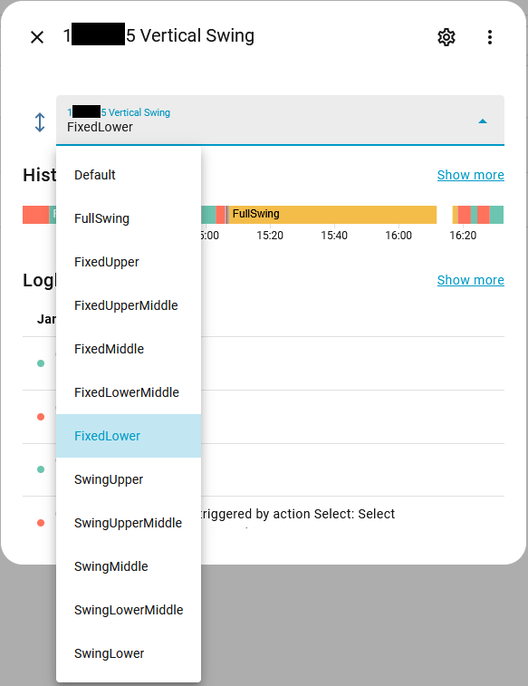
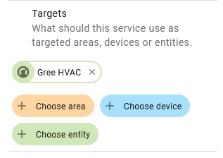
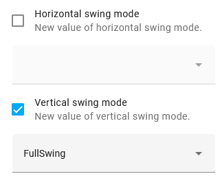

# hass_GreeExt
Gree Extension for Home-Assistant built in integration

Allows setting different swing positions for the default Gree integration.

## Custom Component Installation

1. Copy the custom_components folder to your own hass `/config` folder.

2. In your configuration.yaml add the following:
  
   ```yaml
   gree_ext:
   ```
## Usage

### Select entities

Two `Select` entities are added for each climate device to control the horizontal and vertical swings.


And they can be controlled by selecting a different swing state.




### Service
```yaml
   service: gree_ext.set_swing_mode_ext
   target:
     entity_id: climate.eeeeffff
   data:
     swing_mode_vertical: FixedMiddle
```
   
Usage on UI:
1. Create a new button for example.

2. Set the action to Call Service.


3. Add target to the action. This can be an entity, a device, or an area (will control all the gree climates in the area).



4. Make the desired changes.

